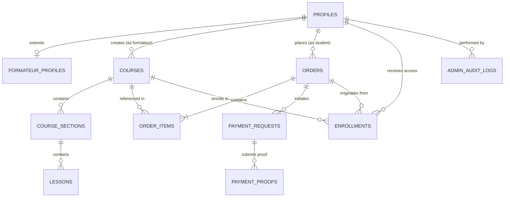

# PHASE 02: Supabase Database, Schema, RLS & Storage Security

## Overview
This document specifies the complete PostgreSQL database architecture, Zero-Trust Row Level Security (RLS) policies, atomic security functions, storage bucket permissions, and TypeScript data models implemented in **PHASE 02** for the **MAWJA Education Platform** (منصة موجة للتعليم الرقمي).

> [!IMPORTANT]
> **V1 Manual / Offline Payment Architecture**:
> In V1, MAWJA does **NOT** integrate an automated electronic payment gateway (such as Stripe or CIB/SATIM gateway).
> Payment is strictly manual/offline:
> 1. Student places an order and initiates a payment request.
> 2. Student transfers funds externally (e.g., via BaridiMob or CCP).
> 3. Student uploads an image or PDF proof of payment to the private storage bucket.
> 4. Platform Administrator audits the proof and executes `admin_approve_payment()` or `admin_reject_payment()`.
> 5. Active course enrollments are provisioned atomically upon approval by the database engine.

---

## 1. PostgreSQL Enums

| Enum Name | Allowed Values | Description |
|---|---|---|
| `user_role` | `STUDENT`, `FORMATEUR`, `ADMIN` | Platform authorization roles (Default: `STUDENT`) |
| `course_level` | `BEGINNER`, `INTERMEDIATE`, `ADVANCED`, `ALL_LEVELS` | Course complexity scale |
| `course_status` | `DRAFT`, `PENDING_REVIEW`, `PUBLISHED`, `ARCHIVED` | Course publication lifecycle |
| `lesson_content_type` | `VIDEO`, `ARTICLE`, `QUIZ`, `ATTACHMENT` | Lesson media format |
| `order_status` | `PENDING_PAYMENT`, `PROOF_SUBMITTED`, `APPROVED`, `REJECTED`, `CANCELLED` | Order lifecycle |
| `payment_method` | `BARIDIMOB`, `CCP`, `BANK_TRANSFER`, `CASH` | Offline payment method categories |
| `payment_request_status`| `PENDING`, `PROOF_SUBMITTED`, `APPROVED`, `REJECTED`, `CANCELLED` | Payment attempt status |
| `payment_proof_status` | `PENDING`, `APPROVED`, `REJECTED` | Receipt review status |
| `enrollment_status` | `ACTIVE`, `SUSPENDED`, `COMPLETED` | Student course access state |

---

## 2. Relational Schema & Tables



### Table Specifications

1. **`profiles`**: Public profile linked 1:1 with `auth.users`. Contains `role` (immutable from client), `full_name`, `email`, `avatar_url`, and `is_active`.
2. **`formateur_profiles`**: Instructor metadata (`bio`, `headline`, `social_links`, `commission_rate`, `is_verified`). Note: `commission_rate` and `is_verified` are locked from instructor edits.
3. **`courses`**: Course catalog headers (`formateur_id`, `title`, `slug`, `price`, `level`, `status`).
4. **`course_sections`**: Ordered sections within courses (`uq_course_sections_course_order`).
5. **`lessons`**: Ordered lessons within sections (`uq_lessons_section_order`).
6. **`orders`**: Multi-course checkout headers with auto-generated order numbers (`MAWJA-YYYY-XXXXXX`).
7. **`order_items`**: Line items linking orders to courses with `unit_price`.
8. **`payment_requests`**: Payment attempt sessions per order.
9. **`payment_proofs`**: Receipt submissions with `file_hash` and `transaction_reference` duplicate detection indexing. Allows multiple proof submissions per order to support retries after rejection.
10. **`enrollments`**: Active course access permissions with `UNIQUE(student_id, course_id)`.
11. **`admin_audit_logs`**: Append-only security audit trail recording administrative role changes and payment approvals/rejections.

---

## 3. Security Architecture & Database Functions

### 3.1 Profile Creation Trigger (`handle_new_user()`)
- Automatically fires `AFTER INSERT` on `auth.users`.
- Guarantees that every new sign-up is provisioned as `STUDENT`. Any elevated role passed in client metadata is strictly ignored.

### 3.2 Controlled Role Management (`admin_set_user_role()`)
- `SECURITY DEFINER` with fixed `SET search_path = public, pg_temp`.
- Validates caller is authenticated and holds `ADMIN` role.
- Prevents self-demotion or unverified role tampering.
- Emits an entry to `admin_audit_logs`.

### 3.3 Atomic Payment Approval (`admin_approve_payment()`)
- `SECURITY DEFINER` with fixed `SET search_path = public, pg_temp`.
- Validates caller is authenticated and holds `ADMIN` role.
- Verifies proof is `PENDING`.
- Updates `payment_proofs` (`APPROVED`), `payment_requests` (`APPROVED`), and `orders` (`APPROVED`).
- Iterates over all `order_items` and provisions `enrollments` (`ACTIVE`) with conflict resolution.
- Writes full details to `admin_audit_logs`.

### 3.4 Atomic Payment Rejection (`admin_reject_payment()`)
- `SECURITY DEFINER` with fixed `SET search_path = public, pg_temp`.
- Validates caller is authenticated and holds `ADMIN` role.
- Records mandatory `rejection_reason`.
- Updates `payment_proofs` (`REJECTED`), `payment_requests` (`REJECTED`), and `orders` (`REJECTED`).
- Writes to `admin_audit_logs`.

---

## 4. Zero-Trust Row Level Security (RLS) Test Matrix

| Entity | Action | ANONYMOUS | STUDENT | FORMATEUR | ADMIN |
|---|---|---|---|---|---|
| **`profiles`** | SELECT | ALLOW (Active) | ALLOW (Active/Own) | ALLOW (Active/Own) | ALLOW (All) |
| | UPDATE | DENY | ALLOW (Own safe fields) | ALLOW (Own safe fields) | ALLOW (All) |
| | Role Change | DENY | DENY | DENY | ALLOW (`admin_set_user_role`) |
| **`formateur_profiles`** | SELECT | ALLOW (Verified) | ALLOW (Verified) | ALLOW (Own/Verified) | ALLOW (All) |
| | UPDATE | DENY | DENY | ALLOW (Bio/Socials) | ALLOW (All) |
| **`courses`** | SELECT | ALLOW (Published) | ALLOW (Published) | ALLOW (Published/Own) | ALLOW (All) |
| | INSERT | DENY | DENY | ALLOW (Own) | ALLOW (All) |
| | UPDATE | DENY | DENY | ALLOW (Own) | ALLOW (All) |
| | DELETE | DENY | DENY | ALLOW (Own Draft/Archived) | ALLOW (All) |
| **`course_sections`** | SELECT | ALLOW (Published) | ALLOW (Published) | ALLOW (Published/Own) | ALLOW (All) |
| | INSERT / UPDATE / DELETE | DENY | DENY | ALLOW (Own Course) | ALLOW (All) |
| **`lessons`** | SELECT | ALLOW (Metadata/Preview) | ALLOW (Enrolled/Preview) | ALLOW (Own Course) | ALLOW (All) |
| | INSERT / UPDATE / DELETE | DENY | DENY | ALLOW (Own Course) | ALLOW (All) |
| **`orders`** | SELECT | DENY | ALLOW (Own) | DENY | ALLOW (All) |
| | INSERT | DENY | ALLOW (Own Pending) | DENY | ALLOW (All) |
| | UPDATE / DELETE | DENY | DENY | DENY | ALLOW (All) |
| **`order_items`** | SELECT | DENY | ALLOW (Own Order) | DENY | ALLOW (All) |
| | INSERT | DENY | ALLOW (Own Order) | DENY | ALLOW (All) |
| **`payment_requests`**| SELECT | DENY | ALLOW (Own Order) | DENY | ALLOW (All) |
| | INSERT | DENY | ALLOW (Own Order) | DENY | ALLOW (All) |
| **`payment_proofs`** | SELECT | DENY | ALLOW (Own Order) | DENY | ALLOW (All) |
| | INSERT | DENY | ALLOW (Own Request/Pending) | DENY | ALLOW (All) |
| | Approval/Rejection | DENY | DENY | DENY | ALLOW (Secure Functions) |
| **`enrollments`** | SELECT | DENY | ALLOW (Own) | ALLOW (Own Courses) | ALLOW (All) |
| | Direct INSERT/UPDATE | DENY | DENY | DENY | ALLOW (Admin / Functions) |
| **`admin_audit_logs`**| SELECT / MODIFY | DENY | DENY | DENY | SELECT ONLY (Admin) |

---

## 5. Storage Buckets & Policies

| Bucket | Access | Allowed MIME Types | Size Limit | Access Policy |
|---|---|---|---|---|
| **`public-assets`** | Public | Images (`jpeg`, `png`, `webp`, `svg`) | 5 MB | Public read. Authenticated users write avatars. Formateurs write course thumbnails. Admins write all. |
| **`private-proofs`** | **PRIVATE** | Images + PDF (`jpeg`, `png`, `webp`, `pdf`) | 10 MB | Zero public read. Students upload and view own receipts (`{user_id}/*`). Admin has full read access. |
| **`course-materials`**| **PRIVATE** | Video + Docs + Archives | 500 MB | Zero public read. Formateur owner can manage. Actively enrolled students (`ACTIVE` enrollment) can read. Admin has full access. |

---

## 6. Migration Structure
```text
supabase/
├── migrations/
│   ├── 00001_initial_schema.sql       # Enums, core tables, relationships, constraints, and indexes
│   ├── 00002_functions_triggers.sql   # Reusable updated_at triggers, order generator, role & payment functions
│   ├── 00003_rls.sql                  # Row Level Security enabled with Zero-Trust policies across all tables
│   └── 00004_storage.sql              # Storage buckets provisioning and storage.objects RLS policies
└── seed.sql                           # Safe development seed script with zero secrets
```
