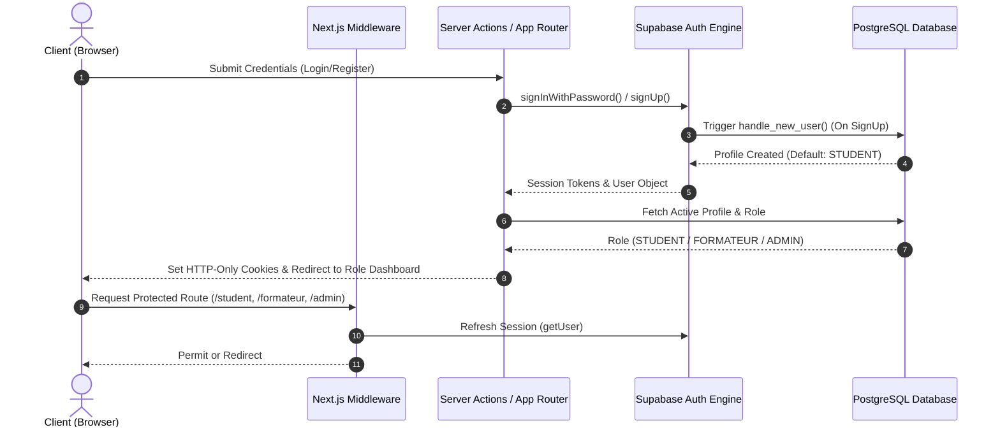

# PHASE 03: Authentication, Session Management & RBAC

## Overview
This document specifies the complete authentication architecture, session management lifecycle, Role-Based Access Control (RBAC), and server-side authorization implemented in **PHASE 03** for the **MAWJA Education Platform** (منصة موجة للتعليم الرقمي).

---

## 1. Authentication Architecture

---

## 2. Roles & Authorization Boundaries

MAWJA enforces exactly 3 distinct user roles:

1. **`STUDENT`**:
   - Standard learner account created automatically upon registration.
   - Access: `/student`, `/student/*`, course catalog, public pages.
   - Restricted: Cannot access `/admin`, `/formateur`, or manage platform entities.

2. **`FORMATEUR`**:
   - Verified instructor account.
   - Registration at `/register/formateur` provisions account as `STUDENT` with instructor onboarding metadata.
   - Elevated to `FORMATEUR` exclusively when Platform Administrator approves and executes `admin_set_user_role(target_id, 'FORMATEUR')`.
   - Access: `/formateur`, `/formateur/*`, own courses, sections, lessons, materials.
   - Restricted: Cannot access `/admin` or financial payment verification queues.

3. **`ADMIN`**:
   - Platform Owner.
   - Cannot be created via registration or client inputs.
   - Access: `/admin`, `/admin/*`, payment proof review functions, role management, audit logs.

---

## 3. Route Protection & Middleware Matrix

| Route | Anonymous | STUDENT | FORMATEUR | ADMIN |
|---|---|---|---|---|
| `/` | ALLOW | ALLOW | ALLOW | ALLOW |
| `/courses`, `/courses/[slug]` | ALLOW | ALLOW | ALLOW | ALLOW |
| `/login`, `/register`, `/forgot-password` | ALLOW | REDIRECT (`/student`) | REDIRECT (`/formateur`) | REDIRECT (`/admin`) |
| `/student`, `/student/*` | REDIRECT (`/login`) | **ALLOW** | **ALLOW** | **ALLOW** |
| `/formateur`, `/formateur/*` | REDIRECT (`/login`) | **DENY** (403/Redirect) | **ALLOW** | **ALLOW** |
| `/admin`, `/admin/*` | REDIRECT (`/login`) | **DENY** (403/Redirect) | **DENY** (403/Redirect) | **ALLOW** |

---

## 4. Server-Side Authorization Utilities (`src/lib/auth.ts`)

- `getCurrentUser()`: Fetches auth user from session context.
- `getCurrentProfile()`: Queries `public.profiles` ensuring `is_active === true`.
- `requireUser(redirectPath?)`: Redirects to `/login` if unauthenticated.
- `requireRole(allowedRoles, redirectPath?)`: Enforces role check on the server; redirects unauthorized users safely.
- `requireAdmin()`: Enforces `ADMIN` role.
- `requireFormateur()`: Enforces `FORMATEUR` or `ADMIN` role.
- `requireStudent()`: Enforces active user session.

---

## 5. Password Reset & Email Verification Flows

- **Password Reset Request (`/forgot-password`)**:
  - Validates email format.
  - Sends reset email with redirect URL `${origin}/auth/callback?next=/reset-password`.
  - Responds neutrally to prevent account enumeration.
- **Set New Password (`/reset-password`)**:
  - Authenticated recovery session updates password via `supabase.auth.updateUser()`.
- **Auth Callback Handler (`/auth/callback`)**:
  - Exchanges verification code for session tokens and redirects user seamlessly.

---

## 6. Security Guarantees & Non-Negotiables

1. **Client Role Immunity**: No client-supplied role is ever trusted. Registration trigger strictly hardcodes `role = 'STUDENT'`.
2. **Service Role Isolation**: `SUPABASE_SERVICE_ROLE_KEY` is server-only, protected by `import "server-only";`.
3. **Defense in Depth**: Next.js Middleware provides fast edge route protection, while Server Component guards (`requireRole`) and PostgreSQL RLS provide unbypassable authorization authority.
