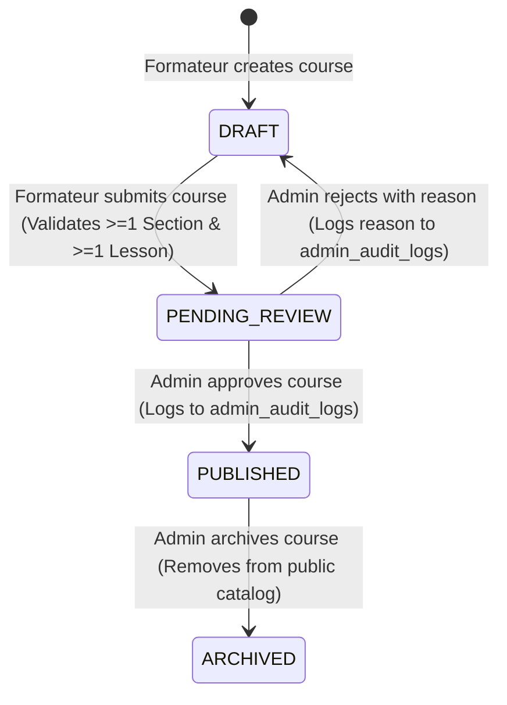

# PHASE 04: Course Catalog, Course Management & Curriculum Builder

## Overview
This document specifies the complete course ecosystem, publishing lifecycle, curriculum builder, public discovery engine, and administrative review workflows implemented in **PHASE 04** for the **MAWJA Education Platform** (منصة موجة للتعليم الرقمي).

---

## 1. Course Architecture & Hierarchy

```
COURSE (Metadata, Pricing, Level, Status, Instructor)
  └── COURSE_SECTION (Chapter Order, Title)
        └── LESSON (Order, Title, Content Type [VIDEO|ARTICLE|QUIZ|ATTACHMENT], Preview Flag, Duration)
```

---

## 2. Course Publishing Lifecycle State Machine



1. **`DRAFT`**:
   - Private to the creating Formateur.
   - Fully editable (metadata, sections, lessons).
   - Inaccessible to public visitors and standard students.
2. **`PENDING_REVIEW`**:
   - Locked for review by Platform Administrator.
   - Appears in `/admin/courses` review queue.
   - Inaccessible to public visitors.
3. **`PUBLISHED`**:
   - Publicly searchable and visible in `/courses` and `/courses/[slug]`.
   - Accessible for preview lessons and enrollment.
4. **`ARCHIVED`**:
   - Hidden from public catalog. Existing enrollments remain intact.

---

## 3. Public Course Catalog & Discovery (`/courses`)

- **Server-Side Rendering**: Fetches strictly `PUBLISHED` courses.
- **Search**: Debounced URL-state query (`?q=...`) filtering across title and keywords.
- **Category Filter**: (`?category=...`).
- **Level Filter**: (`?level=BEGINNER|INTERMEDIATE|ADVANCED|ALL_LEVELS`).
- **Sorting**: Newest (`created_at DESC`), Price Ascending, Price Descending.
- **Pagination**: Server-side range limiting (`range(from, to)`).

---

## 4. Course Details & Curriculum Preview (`/courses/[slug]`)

- **Route Guard**: Rejects unpublished courses with Next.js `notFound()`.
- **Dynamic SEO Metadata**: `generateMetadata` dynamically resolves OpenGraph and title tags from live course data.
- **Curriculum Outline**: Displays structured sections, lessons, durations, and `is_free_preview` markers.
- **Pricing & CTA**: Formats authoritative database price in Algerian Dinars (DZD).

---

## 5. Formateur Course Management (`/formateur/courses`)

- **Ownership Isolation**: Queries strictly enforce `formateur_id = auth.uid()`. Formateur A cannot view or manipulate Formateur B's courses.
- **Course Creation (`/formateur/courses/new`)**: Validates title, unique slug, categories, levels, and price via Zod `courseSchema`.
- **Curriculum Builder (`/formateur/courses/[id]/curriculum`)**:
  - Add / edit / delete chapters (`course_sections`).
  - Add / edit / delete lessons (`lessons`) with type selection (`VIDEO`, `ARTICLE`, `QUIZ`, `ATTACHMENT`).
  - Flag free preview lessons (`is_free_preview = true`).
  - Submit for review action validates curriculum completeness before transitioning state.

---

## 6. Admin Course Review Dashboard (`/admin/courses`)

- **Access Guard**: Strictly restricted to active `ADMIN` via `requireAdmin()`.
- **Review Queue**: Lists pending courses with complete curriculum breakdown and instructor details.
- **Admin Actions**:
  - **Approve**: Transitions status to `PUBLISHED` and emits `COURSE_APPROVED` audit log.
  - **Reject**: Transitions status to `DRAFT`, records mandatory feedback in `rejection_reason`, and emits `COURSE_REJECTED` audit log.
  - **Archive**: Transitions status to `ARCHIVED` and emits `COURSE_ARCHIVED` audit log.

---

## 7. Storage Security & Materials

- **Public Assets (`public-assets`)**: Course thumbnails and instructor avatars.
- **Course Materials (`course-materials`)**: Strictly private bucket storing lesson videos and protected attachments (`{formateur_id}/{course_id}/*`). Direct public URLs are disallowed.

---

## 8. Known Limitations & Deferred Scopes
1. **Deferred to PHASE 05**: Payment processing, manual CCP/BaridiMob transfer receipts review, and enrollment purchasing workflow.
2. **Deferred to PHASE 06**: Protected video player streaming, progress tracking, and student classroom.
